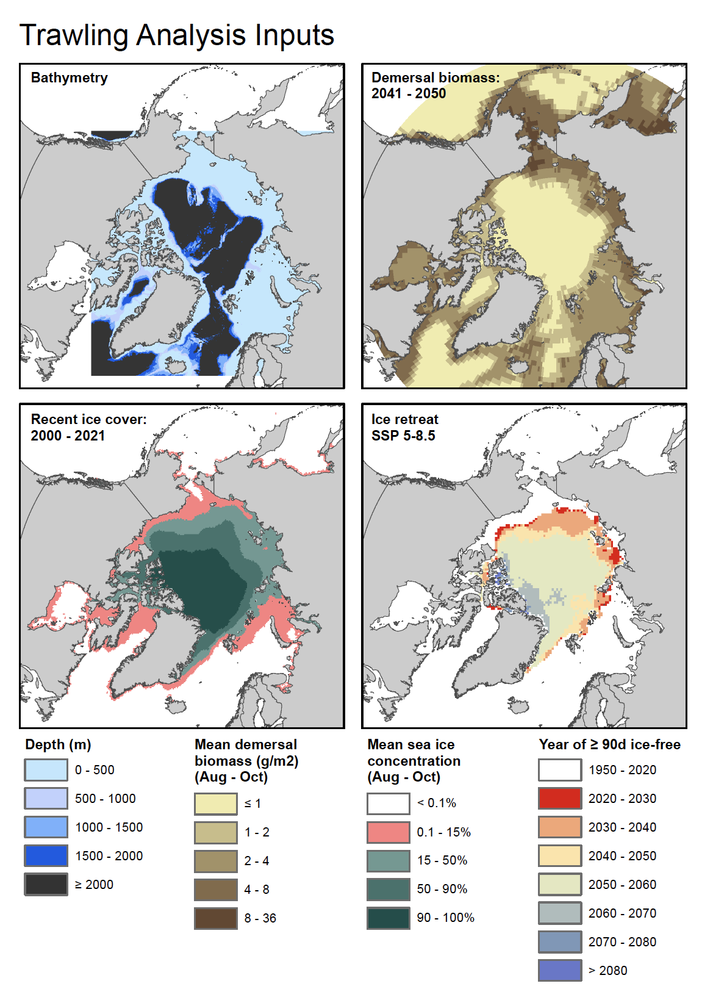

# zoonotic-C
Calculations and figures to support Collins et al., "Storage and fluxes of zoogeochemical carbon in the global ocean: Review and synthesis of current knowledge, directions for future research, and scientific readiness of interventions for climate mitigation," a review in preparation for *Global Biogeochemical Cycles*, and a separate analysis of the possible climate impacts from new benthic trawling in the emerging Arctic, with EDF co-authors.

**Note:** Code and data for refinement/constraint of the benthic trawling CO2 emissions estimate presented in [Sala et al., 2021. Protecting the global ocean for biodiversity, food and climate. *Nature* **592**, 397–402](https://doi.org/10.1038/s41586-021-03371-z), to be submitted as Matters Arising comment to *Nature*, has been moved to [a new repository](https://github.com/jamesrco/global-trawling-CO2).

### Raw, unmodified data and files

#### Arctic benthic trawling and seabed disturbance analysis 

* Spatial data for the Arctic benthic trawling and seabed disturbance analysis, including future biomass and ice extent simulations from various models, can be found in [data/arctic_trawling/spatial_inputs](data/arctic_trawling/spatial_inputs). These were generated by [@mmoritsch](https://github.com/mmoritsch). The [README file](data/arctic_trawling/spatial_inputs/README.txt) in this folder contains some notes about each dataset. More details on data provenence will be posted here as the project progresses.

* The folder [data/arctic_trawling/catch_data](data/arctic_trawling/catch_data) contains a file with annual average catch data (2000-2016) for bottom-trawled species managed under the Northeast Atlantic Fisheries Commission and North Atlantic Salmon Conservation Organization Regional Fisheries Management Organizations.

    
**Figure 1.** An overview of the various spatial datasets [@mmoritsch](https://github.com/mmoritsch) produced for this part of the project.

#### Global benthic trawling reanalysis

* Items have been moved to [this repository](https://github.com/jamesrco/global-trawling-CO2).

### Scripts

#### Shell scripts for AWS provisioning

* The shell scripts in [aws_provisioning](aws_provisioning) are designed to be run in order on an AWS Ubuntu instance, to configure the remote virtual machine for running the various R scripts in this repository. They could be used to provision an Ubuntu instance to work generally with geospatial data in R. The fourth script ([04_ubuntu_mailnotify.sh](aws_provisioning/04_ubuntu_mailnotify.sh)) and accompanying text file in the "ssmtp" folder are not critical, but configure the remote machine to send simple email alerts (e.g., notification when a task is completed) to a supplied email address. *Note that user (if not me) will have to supply an email address and password. For obvious reasons, I removed the password from the file before I committed it.* 

#### Zoogeochemical carbon fluxes

* The script [OpenOceanNCSfigs.R](OpenOceanNCSfigs.R) was used to generate the figures appearing in Collins et al., "Storage and fluxes of zoogeochemical carbon in the global ocean: Review and synthesis of current knowledge, directions for future research, and scientific readiness of interventions for climate mitigation," a review in preparation for the journal *Global Biogeochemical Cycles*

#### Global benthic trawling reanalysis

* Items have been moved to [this repository](https://github.com/jamesrco/global-trawling-CO2).

### Outputs and derived data

#### Zoogeochemical carbon fluxes

* The .csv file [Open_ocean_NCS_C_data.csv](data/Open_ocean_NCS_C_data.csv) contains the input data collected from the literature for the figures and tables in Collins et al., "Storage and fluxes of zoogeochemical carbon in the global ocean: Review and synthesis of current knowledge, directions for future research, and scientific readiness of interventions for climate mitigation," a review in preparation for the journal *Global Biogeochemical Cycles*. The references from which the various flux and reservoir estimates were obtained are given in the file.

#### Global benthic trawling reanalysis

* Items have been moved to [this repository](https://github.com/jamesrco/global-trawling-CO2).
